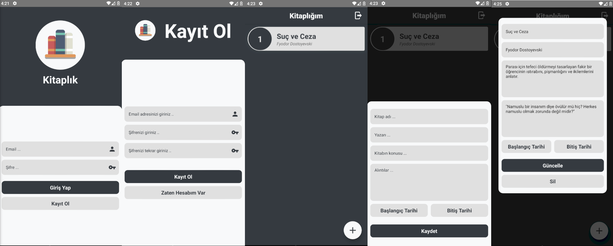

# ⚛️ React Native My Library App

<ul style="list-style-type:disc">
   <li>Coded a React Native App by focusing Android platforms.</li>
   <li>Used Firebase to store data.</li>
</ul>

# 📌 Installation

🚧 If you want to install project, you should make <a href="https://rnfirebase.io/">Firebase configurations.</a>

### Clone
   ```bash
   git clone https://github.com/MhmtMutlu/react-native-library.git
   ```

### Install
   ```bash
   yarn install
   ```

### Start
   ```bash
   yarn run android | yarn run ios
   ```

# 🎞 Screenshot



# 🧰 Technologies

<ul style="list-style-type:disc">
   <li><a href="https://nodejs.org/en/">React Native</a></li>
   <li><a href="https://formik.org/">Formik</a></li>
   <li><a href="https://github.com/jquense/yup">Yup</a></li>
   <li><a href="https://firebase.google.com/">Firebase</a></li>
   <li><a href="https://rnfirebase.io/">React Native Firebase</a></li>
   <li><a href="https://callstack.github.io/react-native-testing-library/">React Native Tesling Library</a></li>
   <li><a href="https://jestjs.io/">Jest</a></li>
   <li><a href="https://www.npmjs.com/package/react-native-flash-message">React Native Flash Message</a></li>
   <li><a href="https://github.com/react-native-modal/react-native-modal">React Native Modal</a></li>
   <li><a href="https://github.com/oblador/react-native-vector-icons">React Native Vector Icons</a></li>
   <li><a href="https://github.com/lottie-react-native/lottie-react-native">React Native LottieView</a></li>
</ul>

# 📌 Todos

- [ ] Complete testing all component and pages
